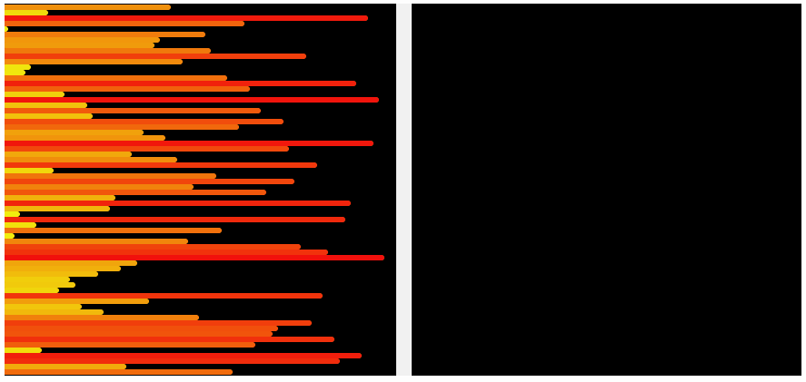

# push_swap  
[42-Cursus] A sorting algorithm project where you must sort data on a stack using a limited set of instructions in the fewest moves possible.  
This project is designed to enhance skills in **sorting algorithm design**, **stack manipulation**, and **C programming**.



Keywords: 
- Sorting algorithms  
- Stack manipulation  
- C programming
- Algorithm optimization  
- Complexity analysis

---

## Overview  
The **push_swap** project involves sorting a stack of integers using two stacks (`stack_a` and `stack_b`) and a limited set of operations. The goal is to sort the numbers in ascending order with the fewest possible moves.  

You will need to implement various sorting algorithms and choose the most efficient solution for different configurations of integers. This project is a great way to learn about **algorithm complexity** and **optimization**.

---

## Features  
- Sort a stack of integers using a limited set of operations.  
- Use two stacks (`stack_a` and `stack_b`) to manipulate the data.  
- Implement efficient sorting algorithms to minimize the number of moves.  
- Handle edge cases such as duplicate numbers, invalid inputs, and empty stacks.  
- Validate the correctness of the sorting using a provided checker program.  

### Operations Allowed  
- **sa**: Swap the first two elements of `stack_a`.  
- **sb**: Swap the first two elements of `stack_b`.  
- **ss**: Perform `sa` and `sb` simultaneously.  
- **pa**: Push the first element of `stack_b` to `stack_a`.  
- **pb**: Push the first element of `stack_a` to `stack_b`.  
- **ra**: Rotate `stack_a` (shift all elements up by one, the first element becomes the last).  
- **rb**: Rotate `stack_b` (shift all elements up by one, the first element becomes the last).  
- **rr**: Perform `ra` and `rb` simultaneously.  
- **rra**: Reverse rotate `stack_a` (shift all elements down by one, the last element becomes the first).  
- **rrb**: Reverse rotate `stack_b` (shift all elements down by one, the last element becomes the first).  
- **rrr**: Perform `rra` and `rrb` simultaneously.  

---

## Performance Requirements  
To validate the project, you must meet the following performance criteria:  
- **100 random numbers**: Sort in less than **700 moves**.  
- **500 random numbers**: Sort in less than **5500 moves**.  

These benchmarks ensure that your algorithm is efficient and optimized for larger datasets.

---

## What I Learned  
This project was a great opportunity to deepen my understanding of:  
- **Sorting Algorithms**: Implementing and comparing different algorithms like **quicksort**, **insertion sort**, and **merge sort**.  
- **Algorithm Complexity**: Analyzing the time and space complexity of different approaches.  
- **Data Structures**: Using stacks and linked lists to manipulate data efficiently.  
- **Optimization**: Reducing the number of operations to achieve the desired result.  
- **Error Handling**: Validating inputs and handling edge cases gracefully.  

---

## Installation  
Requires a C compiler (e.g., `gcc`) and the **libft** library (optional).  

### How to Run  
1. Clone this repository:  
   ```bash  
   git clone https://github.com/yourusername/push_swap.git  
   cd push_swap  
   ```  

2. Compile the project using the provided **Makefile**:  
   ```bash  
   make  
   ```  

3. Run the program with a list of integers as arguments:  
   ```bash  
   ./push_swap 3 2 1 0  
   ```  

4. Use the **checker** program to validate the sorting:  
   ```bash  
   ARG="3 2 1 0"; ./push_swap $ARG | ./checker_linux $ARG  
   ```  
   If the output is **OK**, the stack is sorted correctly.  

---

## Bonus: Checker Program  
The **checker** program is a bonus feature that validates whether the instructions generated by `push_swap` correctly sort the stack.  

### How to Use  
1. Compile the checker program:  
   ```bash  
   make bonus  
   ```  

2. Run the checker with a list of integers:  
   ```bash  
   ./checker 3 2 1 0  
   ```  

3. Input the instructions generated by `push_swap`. If the stack is sorted, the checker will output **OK**; otherwise, it will output **KO**.  

---

## Author  

- **Name**: Oliver King Zamora  
- **GitHub**: [oliverkingz](https://github.com/oliverkingz)  
- **42 Login**: ozamora-  

---

## Acknowledgments  
This project is part of the **42 Cursus**, a rigorous programming curriculum that emphasizes hands-on learning and problem-solving. Special thanks to the 42 team for providing this challenging and rewarding project!  

--- 
